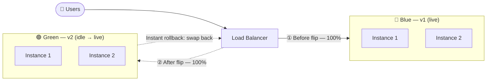
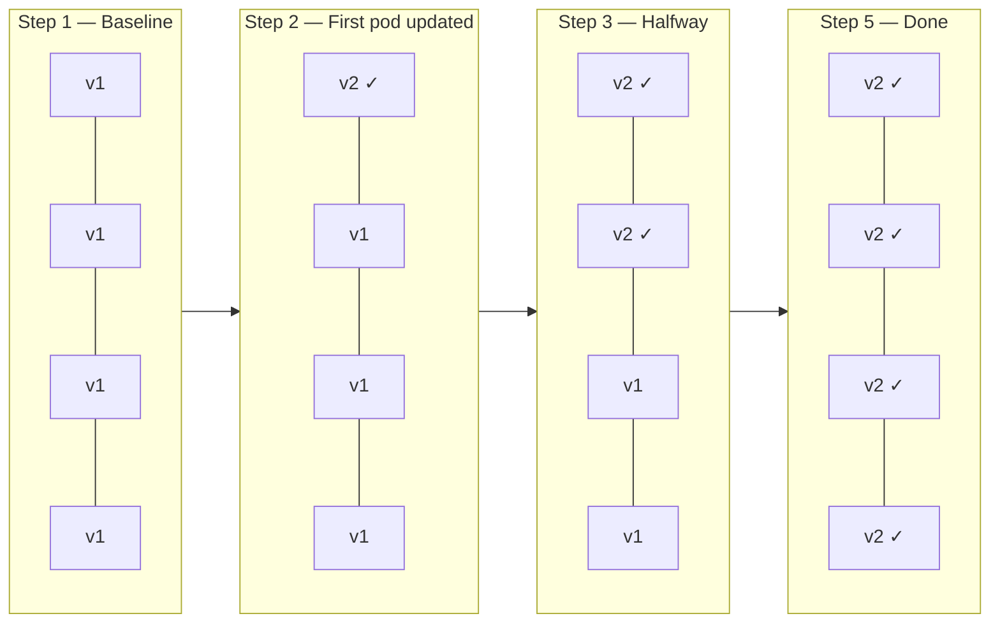
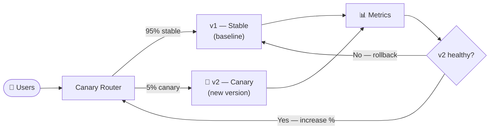
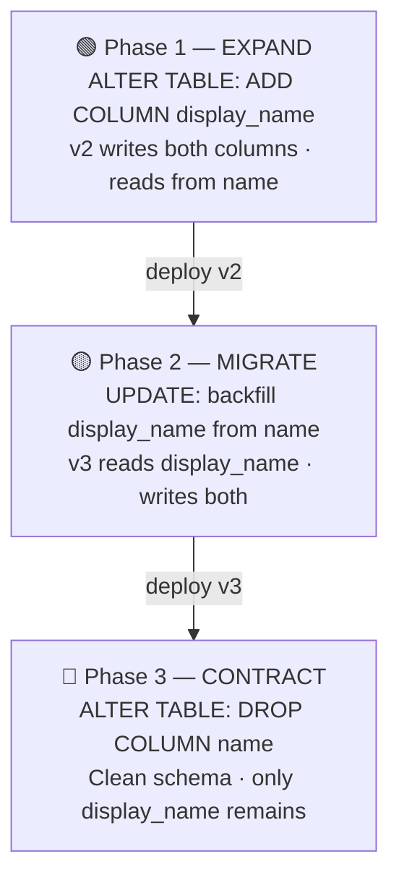
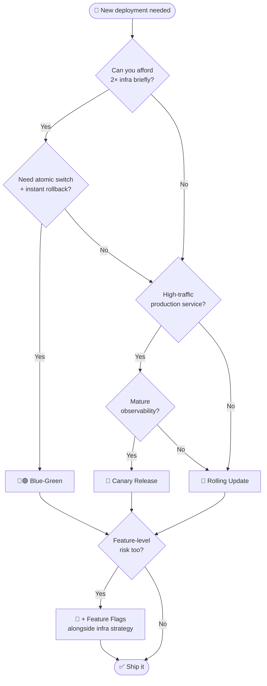

# Zero-Downtime Deployments: Strategies and Tradeoffs

Every deployment is a gamble. You're swapping out a running system mid-flight — like changing the engine of a plane while it's in the air. Do it wrong and users see errors, requests fail, and your on-call phone starts buzzing at 2 AM.

Zero-downtime deployment is the discipline of making that swap invisible. But "invisible" hides a lot of complexity. This post walks through the main strategies, when to use each one, and what they cost you.

---

## Why Downtime Happens in the First Place

Before picking a strategy, it helps to understand where downtime actually comes from:

- **Process restart gap** — the old process dies before the new one is ready
- **Port contention** — old and new can't bind to the same port simultaneously
- **Schema migrations** — the database is in a state neither the old nor new code can handle
- **Cache invalidation** — stale data causes 500s after a deploy
- **In-flight requests** — requests mid-processing get dropped when a process dies

Each strategy addresses these differently. None of them solve all of these at once without some cost.

---

## Strategy 1: Blue-Green Deployments

### How it works

You run two identical production environments — **blue** (live) and **green** (idle). You deploy to green, smoke-test it, then flip a load balancer or DNS record to point traffic from blue to green. Blue becomes your instant rollback target.



### Real example

AWS Elastic Beanstalk's "swap environment URLs" does exactly this. You deploy v2 to a staging environment, run your test suite, then call `aws elasticbeanstalk swap-environment-cnames`. Traffic flips in seconds. If something goes wrong, you swap back.

### Tradeoffs

**Pros:**
- Instant rollback — just flip the switch back
- Green environment acts as a staging/smoke-test target
- No partial state: all users are on one version at a time

**Cons:**
- Double the infrastructure cost while both environments run
- Database is the hard problem — both blue and green share it, so schema changes must be backward-compatible
- DNS-based flips can have propagation lag (use load balancer-level routing instead)
- Warm-up time for green (JVM startup, cache priming) can cause a traffic spike on switch

**Best for:** Stateless services, teams with strict rollback SLAs, apps on managed platforms (Elastic Beanstalk, App Engine).

---

## Strategy 2: Rolling Deployments

### How it works

Instead of replacing everything at once, you update instances gradually — replacing a few at a time while the rest keep serving traffic. The load balancer routes only to healthy instances.



### Real example

Kubernetes rolling updates are the canonical implementation. Your deployment spec controls the pace:

```yaml
strategy:
  type: RollingUpdate
  rollingUpdate:
    maxSurge: 1        # spin up 1 extra pod before killing old ones
    maxUnavailable: 0  # never reduce below desired replica count
```

With these settings, Kubernetes will:
1. Spin up a new v2 pod
2. Wait until it passes readiness checks
3. Only then terminate one v1 pod
4. Repeat

### Tradeoffs

**Pros:**
- No infrastructure doubling (with `maxSurge: 0`)
- Works natively in Kubernetes, ECS, and most orchestrators
- Gradual rollout limits the blast radius of a bad deploy

**Cons:**
- **Both versions run simultaneously** during the rollout window — your API must be backward-compatible with itself
- Slower to complete than blue-green
- Rollback means rolling forward again (another full rollout cycle)
- Health checks must be accurate — a pod that starts but crashes under load will still pass initial checks

**Best for:** Kubernetes-native teams, microservices with stable APIs, when infrastructure cost is a constraint.

---

## Strategy 3: Canary Releases

### How it works

You send a small percentage of traffic to the new version and watch metrics before committing. The name comes from the "canary in a coal mine" — if the canary dies, you know there's a problem before it affects everyone.



You progressively shift traffic: 5% → 25% → 50% → 100%, with automated or manual checks at each stage.

### Real example

Netflix's Spinnaker is built around canary analysis. At each stage it compares key metrics (error rate, latency p99, CPU) between the canary and baseline. If the canary degrades relative to baseline, the pipeline auto-rolls back.

You can approximate this with Nginx using `split_clients`:

```nginx
split_clients "$request_id" $upstream {
  5%   v2_backend;
  *    v1_backend;
}
```

Or with Kubernetes + Argo Rollouts, which handles the traffic shifting and metric analysis natively.

> 💾 **Working example:** [`canary-router.js`](./canary-router.js) — a pure Node.js canary router that splits traffic between v1 and v2, tracks per-version error rates and latency, and warns when the canary degrades. Run with `CANARY_PERCENT=10 node canary-router.js`.

### Tradeoffs

**Pros:**
- Real production validation before full rollout
- Catches issues that staging never would (traffic patterns, data edge cases)
- Blast radius is tiny if something goes wrong early

**Cons:**
- Both versions serve traffic simultaneously — same backward-compat requirement as rolling
- Requires solid observability (you can't make canary decisions without metrics)
- More complex pipeline to build and maintain
- User experience can be inconsistent if users hit different versions across requests (especially problematic for SPAs)

**Best for:** High-traffic services where production behavior is hard to predict in staging. Teams with mature observability.

---

## Strategy 4: Feature Flags (The Invisible Deploy)

### How it works

You decouple **deploying code** from **releasing features**. The new code ships to 100% of servers, but it's dormant behind a flag. You control rollout through config, not deployments.

```python
if feature_flags.enabled("new_checkout_flow", user_id=user.id):
    return new_checkout_flow()
else:
    return legacy_checkout_flow()
```

You can roll out to 1% of users, then 10%, then specific cohorts, then everyone — without a single new deployment.

### Real example

Facebook has deployed code to all servers while exposing features to 0 users, then gradually rolled out to billions. Their internal system (now open-sourced as GK) gates features by user ID, location, device type, and more.

Tools like LaunchDarkly, Unleash, and Statsig give you this out of the box with a dashboard, targeting rules, and kill switches.

> 💾 **Working example:** [`feature-flags.js`](./feature-flags.js) — a zero-dependency feature flag engine with deterministic percentage rollout (FNV-1a hashing), kill switches, user allowlists, stale flag warnings, and an access log. Run with `node feature-flags.js`.

### Tradeoffs

**Pros:**
- Deployment risk decoupled from feature risk — a bad feature flag is a config change to revert, not a rollback
- Enables A/B testing and gradual rollouts without ops involvement
- Works for both frontend and backend features

**Cons:**
- **Flag debt** — old flags never get cleaned up and become landmines
- Code complexity: every flag is a branch, every branch needs testing
- Flags don't help with infrastructure changes or dependency upgrades
- The database still needs to handle both code paths until the old one is removed

**Best for:** Feature launches, A/B testing, kill switches for risky features. Not a substitute for deployment infrastructure — use alongside blue-green or rolling, not instead of.

---

## The Hard Part: Database Migrations

Every strategy above sidesteps the hardest problem: **your database doesn't version with your code**.

When v1 and v2 run simultaneously (rolling, canary) or share a database (blue-green), your schema has to satisfy both versions at once. This rules out most naive migrations.

### The expand-contract pattern

Instead of one migration, you do three deployments:



**Phase 1 — Expand:** Add the new column/table without removing anything.
```sql
ALTER TABLE users ADD COLUMN display_name VARCHAR(255);
```

Deploy v2 which writes to both `name` (old) and `display_name` (new), reads from `name`.

**Phase 2 — Migrate:** Backfill the new column.
```sql
UPDATE users SET display_name = name WHERE display_name IS NULL;
```

Deploy v3 which reads from `display_name`, writes to both.

**Phase 3 — Contract:** Remove the old column once no code references it.
```sql
ALTER TABLE users DROP COLUMN name;
```

This is slower and more tedious than a single migration, but it's the only way to be truly safe with zero-downtime deploys.

### What to avoid

- `NOT NULL` columns without defaults added to existing tables
- Renaming columns directly
- Dropping columns that old code still reads
- Changing column types in ways that break existing queries

---

## Putting It Together: A Decision Framework



| | Blue-Green | Rolling | Canary | Feature Flags |
|---|---|---|---|---|
| **Rollback speed** | Instant | Slow (re-deploy) | Fast | Instant (flag toggle) |
| **Infrastructure cost** | 2x during deploy | ~1x | ~1x | ~1x |
| **Handles DB migrations** | No (shared DB) | No (dual version) | No (dual version) | Partial |
| **Observability needed** | Low | Low | High | Medium |
| **Best rollout size** | All-or-nothing | Gradual | Gradual by % | Granular |

Most mature teams use a combination: rolling or blue-green for the infrastructure layer, canary for traffic validation, and feature flags for product changes. The strategies are complementary, not competing.

---

## Checklist Before Your Next Deploy

> 💾 **Working example:** [`graceful-shutdown.js`](./graceful-shutdown.js) — a Node.js HTTP server demonstrating all three items below: separate liveness/readiness probes, SIGTERM drain with in-flight request tracking, and a hard-exit failsafe timeout. Run with `node graceful-shutdown.js`.

- [ ] Health checks return 200 only when the app is genuinely ready (not just started)
- [ ] Graceful shutdown: app drains in-flight requests before exiting (`SIGTERM` handler)
- [ ] Database migration is backward-compatible with the previous version
- [ ] Readiness probe is separate from liveness probe in Kubernetes
- [ ] You have a tested rollback procedure (not just a theoretical one)
- [ ] Observability is in place: error rate, latency, and saturation dashboards open during deploy

---

## Code Examples

All working scripts from this post are available in the companion zip (`zero-downtime-deployments.zip`):

| File | What it demonstrates | Run |
|---|---|---|
| [`graceful-shutdown.js`](./graceful-shutdown.js) | Liveness + readiness probes, SIGTERM drain, connection tracking | `node graceful-shutdown.js` |
| [`canary-router.js`](./canary-router.js) | Canary traffic split, per-version error rate, rollback warning | `CANARY_PERCENT=10 node canary-router.js` |
| [`feature-flags.js`](./feature-flags.js) | Percentage rollout, kill switches, allowlists, stale flag detection | `node feature-flags.js` |

No dependencies — pure Node.js v14+. Clone and run immediately.

---

## Final Thought

Zero-downtime deployment isn't a single tool you install — it's a set of habits and constraints you build your system around. The earlier you treat backward compatibility and graceful degradation as first-class concerns, the cheaper these strategies become to implement.

The teams that do this best don't deploy carefully. They deploy *constantly*, because they've made deployment boring.
